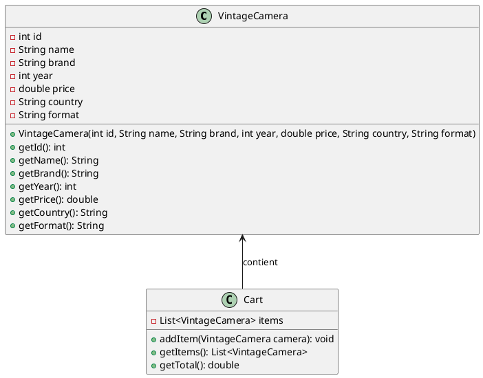
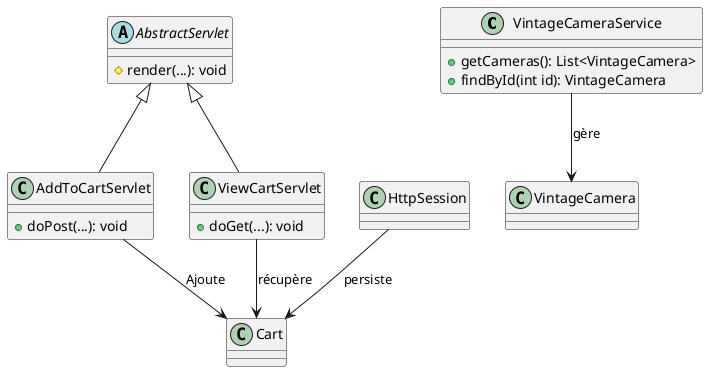

# Moteur de template Pebble

Pebble est un portage du projet Twig, une fois n'est pas coutume, c'est ici Java qui s'est inspiré de ce qui se fait
en PHP. Il est conçu pour être léger, sécurisé et plus facile à utiliser que son principal concurrent Thymeleaf.

**Fonctionnalités principales**

- Syntaxe simple : Pebble utilise une syntaxe claire et intuitive, accessible même aux développeurs non-Java.

- Héritage de templates : Permet de réutiliser du code en définissant des layouts communs que les autres templates
  peuvent étendre.

- Auto-échappement : Par défaut, Pebble échappe les sorties pour éviter les vulnérabilités XSS.

- Extensibilité : Possibilité d'ajouter des tags, filtres et fonctions personnalisés.

- Caching : Les templates sont mis en cache après leur compilation pour améliorer les performances.

- Sécurité renforcée : Exécution en sandbox et validation des accès pour prévenir les attaques par injection de
  commande.

## Installation et premiers pas

```xml
<!-- dans pom.xml -->
<dependency>
    <groupId>io.pebbletemplates</groupId>
    <artifactId>pebble</artifactId>
    <version>3.2.4</version>
</dependency>
```

### Utilisation avec une servlet

Pour utiliser Pebble, il faut obtenir une instance du moteur de template comme ceci :

```java
import com.mitchellbosecke.pebble.PebbleEngine;
import com.mitchellbosecke.pebble.loader.ClasspathLoader;

PebbleEngine engine = new PebbleEngine.Builder()
        .loader(new ClasspathLoader())
        .build();
```

#### Le modèle

Les fichiers de modèle doivent être placés dans un dossier accessible via le classpath,
Par convention `resources/templates`.

Par défaut l'extension des fichiers est `.peb`.

**Exemple de modèle**

```html
<!-- resources/templates/hello.peb -->
<!DOCTYPE html>
<html>
<head>
    <title>{{ title }}</title>
</head>
<body>
<h1>Hello, {{ name }}!</h1>
</body>
</html>
```

#### La servlet

```java
package fr.formation.web;

import io.pebbletemplates.pebble.PebbleEngine;
import io.pebbletemplates.pebble.template.PebbleTemplate;

import jakarta.servlet.ServletException;
import jakarta.servlet.http.*;
import jakarta.servlet.annotation.WebServlet;

import java.io.IOException;
import java.io.Writer;
import java.util.HashMap;
import java.util.Map;

@WebServlet("/hello-pebble")
public class PebbleTestServlet extends HttpServlet {

    private final PebbleEngine engine = new PebbleEngine.Builder().build();

    @Override
    protected void doGet(
            HttpServletRequest req,
            HttpServletResponse resp
    ) throws ServletException, IOException {
        // Charger le template
        PebbleTemplate compiledTemplate = engine.getTemplate(
                "templates/hello.peb"
        );

        // Créer les données pour le template
        Map<String, Object> context = new HashMap<>();
        context.put("title", "Bienvenue");
        context.put("name", "Jean");

        // Rendre le template et envoyer la réponse
        resp.setContentType("text/html");
        Writer writer = resp.getWriter();
        compiledTemplate.evaluate(writer, context);
        writer.close();
    }
}
```

### Exercice de factorisation

Créer une classe héritant de `HttpServlet` et implémenter la méthode render.

#### Correction de la factorisation {collapsible="true"}

**La classe abstraite**

```java
package fr.formation.utils;

import io.pebbletemplates.pebble.PebbleEngine;
import io.pebbletemplates.pebble.template.PebbleTemplate;
import jakarta.servlet.http.HttpServlet;
import jakarta.servlet.http.HttpServletResponse;

import java.io.Writer;
import java.util.Map;

public abstract class AbstractServlet extends HttpServlet {
    private PebbleEngine pebbleEngine;

    @Override
    public void init() {
        // Obtenir le moteur
        pebbleEngine = new PebbleEngine.Builder().build();
    }


    protected void render(
            HttpServletResponse response,
            String templateName,
            Map<String, Object> context
    ) throws Exception {

        // Obtenir le template Pebble
        PebbleTemplate template = pebbleEngine.getTemplate(
                "templates/" + templateName
        );

        // Evaluer le template et envoyer la réponse HTTP
        response.setContentType("text/html");
        Writer writer = response.getWriter();
        template.evaluate(writer, context);
        writer.close();
    }
}

```

**Son utilisation**

```java
package fr.formation.web;

import fr.formation.utils.AbstractServlet;
import jakarta.servlet.annotation.WebServlet;
import jakarta.servlet.http.HttpServletRequest;
import jakarta.servlet.http.HttpServletResponse;

import java.util.HashMap;
import java.util.Map;

@WebServlet("/hello-pebble")
public class HelloPebbleServlet extends AbstractServlet {
    @Override
    protected void doGet(
            HttpServletRequest request,
            HttpServletResponse response
    ) {

        // Préparer le contexte pour le template
        Map<String, Object> context = new HashMap<>();
        context.put("title", "Accueil");
        context.put("name", "Alice");

        try {
            // Rendre le template
            render(response, "hello.peb", context);
        } catch (Exception e) {
            throw new RuntimeException(e);
        }
    }
}
```

## Héritage

Tout comme Twig, Pebble supporte l'héritage de modèles et propose une syntaxe identique à ce premier.

**Un gabarit**

```twig
{# layout.peb #}
<html>
<head>
    <title>My Website</title>
    
      <link
        rel="stylesheet"
        href="https://cdn.jsdelivr.net/npm/@picocss/pico@2/css/pico.min.css"
      >
    
    
    
</head>
<body>
    <main>
        
    </main>
    <footer>
        
            Copyright 2025
        
    </footer>
</body>
</html>
```

**Utilisation du gabarit**

```twig


Accueil



  {# Insertion du contenu du parent pour ce bloc #}
  {{ parent() }}
  
  <style>
    body {
      background-color: green;
    }
  </style>




    <h1>Bienvenue!</h1>
    <p>Cette page hérite de layout</p>

```

## Boucles et conditions

Ici encore la syntaxe est la même que dans Twig

### Condition

```twig

  🥵 Canicule !

  ❄️ Gelées

  😌 Température modérée

```

#### Les opérateurs de comparaison

| **Opérateur**  | **Description**                                                                           |
|----------------|-------------------------------------------------------------------------------------------|
| `==`           | Vérifie si deux valeurs sont égales (null-safe grâce à `java.util.Objects.equals(a, b)`). |
| `equals`       | Alias pour `==`.                                                                          |
| `!=`           | Vérifie si deux valeurs sont différentes.                                                 |
| `<`            | Vérifie si une valeur est strictement inférieure à une autre.                             |
| `>`            | Vérifie si une valeur est strictement supérieure à une autre.                             |
| `<=`           | Vérifie si une valeur est inférieure ou égale à une autre.                                |
| `>=`           | Vérifie si une valeur est supérieure ou égale à une autre.                                |
| `is empty`     | Vérifie si une valeur est vide.                                                           |
| `is not empty` | Vérifie si une valeur n'est pas vide.                                                     |
| `is null`      | Vérifie si une valeur est nulle.                                                          |
| `is not null`  | Vérifie si une valeur n'est pas nulle.                                                    |
| `is even`      | Vérifie si une valeur est paire.                                                          |
| `is odd`       | Vérifie si une valeur est impaire.                                                        |
| `is iterable`  | Vérifie si une valeur est un objet itérable.                                              |
| `is map`       | Vérifie si une valeur est un Map (paire clef/valeur).                                     |
| `contains`     | Vérifie la présence d'une valeur au sein d'une collection.                                |

#### Structure ternaire

```twig
{{ condition ? valeur_si_vrai : valeur_si_faux }}
```

**Quelques exemples**

```twig
<li class="{{ item.selected ? 'selected' : '' }}">
    {{ item.name }}
</li>
```

```twig
{{ user.name is null ? 'Anonyme' : user.name }}
```

### Boucle

#### Boucle sur un tableau ou un objet List

```twig

  {{ article.title }}

  Aucun article trouvé.

```

**Les variables d'itération**

- loop.index : Index basé zéro
- loop.first : true si première itération
- loop.last : true si dernière itération
- loop.length : Taille totale de la collection

**Exemple avec une liste de tags**

La virgule n'est pas ajoutée sur le dernier élément de la liste des tags.

```twig
  
    {{ item.name }}
    , 
  
```

#### Boucle conditionnelle

N'affiche que les éléments qui répondent à la condition.
À n'utiliser que si la liste compléte est également affichée ailleurs dans la page.
Sinon il est plus efficace de transmettre une liste déjà filtrée.

```twig

    <div class="order">
        {{ order.id }} - En attente
    </div>

```

#### Boucle sur un Map

```twig

  {{ entry.key }} = {{ entry.value }}

```

## Les filtres

| **Filtre**     | **Description**                                                               |
|----------------|-------------------------------------------------------------------------------|
| `abbreviate`   | Abrège une chaîne de caractères à une longueur spécifiée.                     |
| `abs`          | Renvoie la valeur absolue d'un nombre.                                        |
| `capitalize`   | Met en majuscule la première lettre d'une chaîne.                             |
| `date`         | Formate une date selon un format donné.                                       |
| `default`      | Fournit une valeur par défaut si la variable est absente ou nulle.            |
| `escape`       | Échappe les caractères spéciaux pour le HTML.                                 |
| `first`        | Renvoie le premier élément d'une collection.                                  |
| `join`         | Concatène les éléments d'une collection avec un séparateur donné.             |
| `last`         | Renvoie le dernier élément d'une collection.                                  |
| `length`       | Renvoie la taille d'une collection ou la longueur d'une chaîne.               |
| `lower`        | Convertit une chaîne en minuscules.                                           |
| `numberformat` | Formate un nombre selon un format spécifique.                                 |
| `raw`          | Désactive l'échappement automatique pour afficher du contenu brut.            |
| `replace`      | Remplace des sous-chaînes dans une chaîne donnée.                             |
| `reverse`      | Inverse l'ordre des éléments d'une collection ou des caractères d'une chaîne. |
| `rsort`        | Trie une collection en ordre décroissant.                                     |
| `slice`        | Extrait une sous-liste ou une sous-chaîne spécifiée par des indices.          |
| `sort`         | Trie une collection en ordre croissant.                                       |
| `split`        | Divise une chaîne en une liste basée sur un séparateur donné.                 |
| `title`        | Met en majuscule la première lettre de chaque mot dans une chaîne.            |
| `trim`         | Supprime les espaces au début et à la fin d'une chaîne.                       |
| `upper`        | Convertit une chaîne en majuscules.                                           |
| `urlencode`    | Encode une chaîne pour être utilisée dans une URL.                            |

## Les fonctions

| **Fonction** | **Description**                                                                  |
|--------------|----------------------------------------------------------------------------------|
| `block()`    | Permet de dupliquer le contenu d'un bloc.                                        |
| `i18n()`     | Fournit la prise en charge de l'internationalisation pour les messages traduits. |
| `max()`      | Renvoie la valeur maximale entre deux ou plusieurs valeurs.                      |
| `min()`      | Renvoie la valeur minimale entre deux ou plusieurs valeurs.                      |
| `parent()`   | Appelle le contenu du bloc parent dans un template enfant.                       |
| `range()`    | Génère une séquence numérique entre deux valeurs spécifiées.                     |

## Exercices

### Boutique d'appareils photo anciens

Soit l'entité et la classe service suivante :

- Créer une servlet et un modèle Pebble pour afficher la liste des appareils dans une table HTML.
- Alterner la couleur de fond des lignes paires et impaires

```java
package fr.formation.entity;

public class VintageCamera {
    private int id;
    private String name;
    private String brand;
    private int year;
    private double price;
    private String country;
    private String format;

    // Constructeur
    public VintageCamera(
            int id,
            String name,
            String brand,
            int year,
            double price,
            String country,
            String format
    ) {

        this.id = id;
        this.name = name;
        this.brand = brand;
        this.year = year;
        this.price = price;
        this.country = country;
        this.format = format;
    }

    // Getters et Setters

    public int getId() {
        return id;
    }

    public VintageCamera setId(int id) {
        this.id = id;
        return this;
    }

    public String getName() {
        return name;
    }

    public VintageCamera setName(String name) {
        this.name = name;
        return this;
    }

    public String getBrand() {
        return brand;
    }

    public VintageCamera setBrand(String brand) {
        this.brand = brand;
        return this;
    }

    public int getYear() {
        return year;
    }

    public VintageCamera setYear(int year) {
        this.year = year;
        return this;
    }

    public double getPrice() {
        return price;
    }

    public VintageCamera setPrice(double price) {
        this.price = price;
        return this;
    }

    public String getCountry() {
        return country;
    }

    public VintageCamera setCountry(String country) {
        this.country = country;
        return this;
    }

    @Override
    public String toString() {
        return "Product{" +
                "id=" + id +
                ", name='" + name + '\'' +
                ", brand='" + brand + '\'' +
                ", year=" + year +
                ", price=" + price +
                ", country=" + country +
                ", format=" + format +
                '}';
    }
}
```

```java
package fr.formation.service;

import fr.formation.entity.VintageCamera;

import java.util.ArrayList;
import java.util.List;

public class VintageCameraService {

    // Méthode pour obtenir une liste d'appareils photo anciens
    public List<VintageCamera> getCameras() {
        List<VintageCamera> cameras = new ArrayList<>();

        cameras.add(new VintageCamera(1, "Leica M3", "Leica", 1954, 2500.00, "Germany", "35mm"));
        cameras.add(new VintageCamera(2, "Canon AE-1", "Canon", 1976, 300.00, "Japan", "35mm"));
        cameras.add(new VintageCamera(3, "Nikon F", "Nikon", 1959, 1500.00, "Japan", "35mm"));
        cameras.add(new VintageCamera(4, "Pentax Spotmatic", "Pentax", 1964, 400.00, "Japan", "35mm"));
        cameras.add(new VintageCamera(5, "Rolleiflex 2.8F", "Rollei", 1960, 3500.00, "Germany", "Medium Format"));
        cameras.add(new VintageCamera(6, "Hasselblad 500C/M", "Hasselblad", 1957, 4500.00, "Sweden", "Medium Format"));
        cameras.add(new VintageCamera(7, "Kodak Retina IIa", "Kodak", 1951, 200.00, "USA", "35mm"));
        cameras.add(new VintageCamera(8, "Olympus OM-1", "Olympus", 1972, 250.00, "Japan", "35mm"));
        cameras.add(new VintageCamera(9, "Minolta X-700", "Minolta", 1981, 200.00, "Japan", "35mm"));
        cameras.add(new VintageCamera(10, "Yashica Mat-124G", "Yashica", 1970, 300.00, "Japan", "Medium Format"));
        cameras.add(new VintageCamera(11, "Contax RTS II", "Contax", 1982, 500.00, "Germany/Japan", "35mm"));
        cameras.add(new VintageCamera(12, "Argus C3 Brick", "Argus", 1939, 100.00, "USA", "35mm"));
        cameras.add(new VintageCamera(13, "Polaroid SX-70", "Polaroid", 1972, 250.00, "USA", "Instant Film"));
        cameras.add(new VintageCamera(14, "Mamiya RB67 Pro-SD", "Mamiya", 1974, 800.00, "Japan", "Medium Format"));
        cameras.add(new VintageCamera(15, "Voigtländer Bessa R2A", "Voigtländer", 2002, 600.00, "Germany/Japan", "35mm"));
        cameras.add(new VintageCamera(16, "Zeiss Ikon Contaflex Super B", "Zeiss Ikon", 1959, 350.00, "Germany", "35mm"));
        cameras.add(new VintageCamera(17, "FED-2 Rangefinder Camera", "FED (Soviet)", 1955, 100.00, "USSR (Russia)", "35mm"));
        cameras.add(new VintageCamera(18, "Zorki-4K Rangefinder Camera", "Zorki (Soviet)", 1972, 120.00, "USSR (Russia)", "35mm"));
        cameras.add(new VintageCamera(19, "Exakta VX IIa SLR Camera", "Exakta Ihagee Dresden", 1956, 300.00, "Germany (East)", "35mm"));

        return cameras;

    }
}

```

#### Correction : Affichage des appareils photo {collapsible="true"}

**La servlet**

```java
package fr.formation.web;

import fr.formation.entity.VintageCamera;
import fr.formation.service.VintageCameraService;
import fr.formation.utils.AbstractServlet;
import jakarta.servlet.ServletException;
import jakarta.servlet.annotation.WebServlet;
import jakarta.servlet.http.HttpServletRequest;
import jakarta.servlet.http.HttpServletResponse;

import java.io.IOException;
import java.util.HashMap;
import java.util.List;
import java.util.Map;

@WebServlet("/cameras")
public class CameraServlet extends AbstractServlet {

    @Override
    protected void doGet(HttpServletRequest request, HttpServletResponse response) throws ServletException, IOException {
        // Récupérer la liste des appareils photo depuis le service
        VintageCameraService cameraService = new VintageCameraService();
        List<VintageCamera> cameras = cameraService.getCameras();


        // Ajouter les données au contexte
        Map<String, Object> context = new HashMap<>();
        context.put("cameras", cameras);

        // Rendre le template
        try {
            render(response, "camera-list.peb", context);
        } catch (Exception e) {
            throw new RuntimeException(e);
        }
    }
}

```

**Le modèle**

```twig


Liste des appareils photo



  {# Insertion du contenu du parent pour ce bloc #}
  {{ parent() }}
  
  <style>
    table {
            width: 100%;
            border-collapse: collapse;
            margin: 20px 0;
            font-size: 18px;
            text-align: left;
        }
        th, td {
            padding: 12px;
            border: 1px solid #ddd;
        }
        th {
            background-color: #f4f4f4;
        }
        tr:nth-child(even) {
            background-color: #f9f9f9; /* Couleur pour les lignes paires */
        }
        tr:nth-child(odd) {
            background-color: #ffffff; /* Couleur pour les lignes impaires */
        }
  </style>




    <h1>Liste des appareils photo anciens</h1>
    <table>
        <thead>
            <tr>
                <th>ID</th>
                <th>Nom</th>
                <th>Marque</th>
                <th>Année</th>
                <th>Prix (€)</th>
                <th>Pays</th>
                <th>Format</th>
            </tr>
        </thead>
        <tbody>
            
                <tr>
                    <td>{{ camera.id }}</td>
                    <td>{{ camera.name }}</td>
                    <td>{{ camera.brand }}</td>
                    <td>{{ camera.year }}</td>
                    <td>{{ camera.price }}</td>
                    <td>{{ camera.country }}</td>
                    <td>{{ camera.format }}</td>
                </tr>
            
        </tbody>
    </table>

```

### Gestion d'un panier

- Créer une classe `Cart`
- Ajouter au panier
- Voir le panier





#### Correction gestion du panier {collapsible="true"}

**La classe Cart**

```java
package fr.formation.entity;

import java.util.ArrayList;
import java.util.List;

public class Cart {
    private List<VintageCamera> items = new ArrayList<>();

    public void addItem(VintageCamera camera) {
        items.add(camera);
    }

    public List<VintageCamera> getItems() {
        // Retourne une copie pour immutabilité
        // Cela évite que l'on puisse modifier le panier
        // depuis l'extérieur de la classe
        return new ArrayList<>(items);
    }

    public double getTotal() {
        return items.stream()
                .mapToDouble(VintageCamera::getPrice)
                .sum();
    }
}
```

**La classe `AddToCartServlet`**

```java
package fr.formation.web;

import fr.formation.entity.VintageCamera;
import fr.formation.service.VintageCameraService;
import jakarta.servlet.annotation.WebServlet;
import jakarta.servlet.http.HttpServletRequest;
import jakarta.servlet.http.HttpServletResponse;
import jakarta.servlet.http.HttpSession;

import java.io.IOException;

@WebServlet("/add-to-cart")
public class AddToCartServlet extends AbstractServlet {

    @Override
    protected void doPost(HttpServletRequest request, HttpServletResponse response)
            throws IOException {

        int cameraId = Integer.parseInt(request.getParameter("cameraId"));
        VintageCamera camera = new VintageCameraService().findById(cameraId);
        HttpSession session = request.getSession();

        Cart cart = (Cart) session.getAttribute("cart");
        if (cart == null) {
            cart = new Cart();
            session.setAttribute("cart", cart);
        }

        if (camera != null) {
            cart.addItem(camera);
        }

        response.sendRedirect("cameras");
    }
}
```

**Ajout de la méthode `findById£ dans CameraService**

```java
public VintageCamera findById(int id) {
    return getCameras().stream()
            .filter(c -> c.getId() == id)
            .findFirst()
            .orElse(null);
}
```

**Bouton "ajouter au panier" dans `cameras.peb`**

```twig
<td>
    <form method="POST" action="add-to-cart">
        <input type="hidden" name="cameraId" value="{{ camera.id }}">
        <button type="submit">🛒 Ajouter au panier</button>
    </form>
</td>
```

**La classe `ViewCartServlet`**

```java
package fr.formation.web;

import fr.formation.entity.Cart;
import fr.formation.utils.AbstractServlet;
import jakarta.servlet.annotation.WebServlet;
import jakarta.servlet.http.HttpServletRequest;
import jakarta.servlet.http.HttpServletResponse;
import jakarta.servlet.http.HttpSession;

import java.util.HashMap;
import java.util.List;
import java.util.Map;

@WebServlet("/cart")
public class ViewCartServlet extends AbstractServlet {

    @Override
    protected void doGet(
            HttpServletRequest request,
            HttpServletResponse response
    ) {
        HttpSession session = request.getSession();
        Cart cart = (Cart) session.getAttribute("cart");

        Map<String, Object> context = new HashMap<>();
        context.put("items", cart != null ? cart.getItems() : List.of());
        context.put("total", cart != null ? cart.getTotal() : 0.0);

        try {
            render(response, "cart.html", context);
        } catch (Exception e) {
            throw new RuntimeException(e);
        }
    }
}
```

**Le modèle `cart.peb`**

```twig


Votre panier



  {# Insertion du contenu du parent pour ce bloc #}
  {{ parent() }}
  
  <style>
        table { width: 100%; border-collapse: collapse; }
        th, td { padding: 8px; text-align: left; border-bottom: 1px solid #ddd; }
        tr:hover { background-color: #f5f5f5; }
  </style>




    <h1>Votre Panier</h1>
    <table>
        <thead>
            <tr>
                <th>Appareil</th>
                <th>Marque</th>
                <th>Prix</th>
            </tr>
        </thead>
        <tbody>
            
            <tr>
                <td>{{ item.name }}</td>
                <td>{{ item.brand }}</td>
                <td>{{ item.price }} €</td>
            </tr>
            
            <tr>
                <td colspan="3">Panier vide</td>
            </tr>
            
        </tbody>
    </table>
    <h3>Total : {{ total }} €</h3>
    <a href="cameras">← Retour à la liste</a>

```


